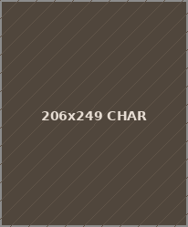

# Naruto Arena — HTML Clone v2
## Full pixel-faithful recreation from screenshots

---

## File Structure

```
naruto-arena/
├── index.html                    ← Homepage (all 3 columns, news, leaderboards)
├── css/
│   ├── style.css                 ← ALL styles (single file)
│   └── shared.js                 ← Optional: JS-based header/sidebar injector
├── images/
│   ├── header-char.png           ← Center header character (transparent PNG, ~270x160px)
│   ├── header-banner.png         ← Right header art (~300x160px)
│   ├── news-banner.png           ← News featured image (~310x90px)
│   ├── helper-banner.png         ← Naruto Helper sidebar banner (~143x36px)
│   └── avatar-mirthless.png      ← Example profile avatar (70x70px)
└── pages/
    ├── profile.html              ← User profile page
    ├── change-avatar.html        ← Avatar picker + Custom Background section
    ├── clan-panel.html           ← Clan Panel (2x4 grid)
    ├── ninja-missions.html       ← All mission categories
    ├── ladders.html              ← Ladder index (RTH, HoF, Ninja, Clan)
    ├── game-manual.html          ← Game manual categories
    ├── start-playing.html        ← Getting started page
    ├── balance-changes.html      ← Patch notes table
    ├── register.html             ← Registration form
    └── control-panel.html        ← Account settings hub
```

---

## How to Open Locally

Just **double-click `index.html`** in any file browser. No server needed.

Works in Chrome, Firefox, Edge, Safari.

---

## Swapping Images

All image slots have placeholder text so the layout is fully visible with no images.
When you're ready, drop files into `images/` with these names:

| File | What it is | Recommended size |
|------|------------|-----------------|
| `header-char.png` | Character in center of header (transparent BG) | ~270x160px |
| `header-banner.png` | Character art on far right of header | ~300x160px |
| `news-banner.png` | Featured image in the news right panel | ~310x90px |
| `helper-banner.png` | Naruto Helper sidebar banner | ~143x36px |
| `avatar-mirthless.png` | Profile page avatar | 70x70px |

To swap the header character: in each HTML file find:
```html
<div class="char-placeholder" ...>🥷</div>
```
Replace with:
```html

```
(Use `../images/header-char.png` for files inside `/pages/`)

---

## Swapping the Site Name / Logo

Find and replace `NARUTO-ARENA.SITE` with your site name in all HTML files.
Find and replace `YOUR #1 NARUTO ONLINE MULTIPLAYER GAME` with your tagline.

Or swap the logo text block for an image:
```html
<div class="logo-title">NARUTO-ARENA.SITE</div>
```
→
```html

```

---

## Switching Between Logged-In / Logged-Out Sidebar

In each HTML file, the sidebar shows the **logged-in** state by default (Welcome, Mirthless + links).

For the **logged-out** login form, find the `<!-- LOGIN FORM -->` comment block in `index.html` and use that instead.

---

## Season Countdown

In `index.html` bottom `<script>` block:
```js
var SEASON_END = new Date('2026-03-14T23:59:59');
```
Change that date to your actual season end date.

---

## Backend Integration Points

- **Login form** → POST to your auth endpoint
- **Register form** → `pages/register.html` button → POST to your register endpoint
- **Online count** → Replace `276` in the `.online-pill` with a live fetch
- **Leaderboards** → Replace hardcoded `.rth-row` / `.lb-row` entries with JS-rendered data
- **Ladders pages** → Populate tables via fetch from your API
- **Avatar picker** → `pickAvatar()` function in `change-avatar.html` → POST to your backend
